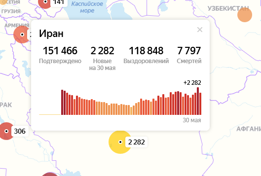

# Maintenance\_TeamStorm

``` 
code in some lang

```
## Сопровождение системы TeamStorm

<figure><figcaption></figcaption></figure>


## Назначение и статус документа

Настоящий документ призван обеспечить уровень сопровождения и регламентирует взаимодействие Заказчика и ООО «ТимШторм» (далее Исполнителя) в процессе эксплуатации системы управления совместной работой TeamStorm, определяет участников этого процесса, их функции и ответственность.

Действие настоящего регламента распространяется на:

* специалистов Заказчика, использующих систему для выполнения своих должностных обязанностей;
* специалистов Заказчика, ответственных за эксплуатацию системы управления совместной работой TeamStorm;
* специалистов Исполнителя, ответственных за техническую поддержку, администрирование и сопровождение системы управления совместной работой TeamStorm.


## Attention!

Be careful!


## Описание процессов, обеспечивающих поддержание жизненного цикла системы управления совместной работой TeamStorm

Поддержание жизненного цикла системы управления совместной работой TeamStorm осуществляется за счет сопровождения системы. Сопровождение системы также включает проведение модернизаций программного кода системы по заявкам заказчика с целью исправления ошибок в системе в случае, если это установлено договором (пакетами услуг «Стандартный» и «Расширенный» предусмотрено плановое обновление системы, куда входит исправление ошибок), восстановление данных и консультации по вопросам эксплуатации, установки и переустановки системы.

Сопровождение системы необходимо для обеспечения:

* отсутствия простоя в работе предприятия Заказчика по причине невозможности функционирования системы (аварийная ситуация, ошибки в работе системы);
* обеспечения гарантий корректного функционирования системы и дальнейшего развития её функционала.

```
some more code
```

Обозначенные цели должны быть достигнуты путем:

* консультирования пользователей и администраторов системы по вопросам эксплуатации (по телефону, факсу, электронной почте) или письменно по запросу Заказчика;
* обеспечение Заказчика новыми версиями системы по мере их выхода (в рамках пакетов услуг «Стандартный» и «Расширенный», согласно таблице 1);
* обеспечение Заказчика актуальными версиями эксплуатационной документации;
* устранение ошибок в случае выявления их при работе с системой.

## Перечень услуг по сопровождению

Компания ООО «ТимШторм» предоставляет следующие пакетные варианты сопровождения системы управления совместной работой TeamStorm, приведенные в таблице 1.

| Пакеты             | Услуги                                                                                                                                                                                                                                                                                                                                                                                                                                                                                                                                                                                                                                                                                                                                                                                                                                                                                                                                                                                                                                                                                                                                                                                                                                                                                                                        |                                                                                                                                                                                                                                                                                                                                                                                                                                                                                                                                           |
| ------------------ | ----------------------------------------------------------------------------------------------------------------------------------------------------------------------------------------------------------------------------------------------------------------------------------------------------------------------------------------------------------------------------------------------------------------------------------------------------------------------------------------------------------------------------------------------------------------------------------------------------------------------------------------------------------------------------------------------------------------------------------------------------------------------------------------------------------------------------------------------------------------------------------------------------------------------------------------------------------------------------------------------------------------------------------------------------------------------------------------------------------------------------------------------------------------------------------------------------------------------------------------------------------------------------------------------------------------------------- | ----------------------------------------------------------------------------------------------------------------------------------------------------------------------------------------------------------------------------------------------------------------------------------------------------------------------------------------------------------------------------------------------------------------------------------------------------------------------------------------------------------------------------------------- |
|                    |                                                                                                                                                                                                                                                                                                                                                                                                                                                                                                                                                                                                                                                                                                                                                                                                                                                                                                                                                                                                                                                                                                                                                                                                                                                                                                                               |                                                                                                                                                                                                                                                                                                                                                                                                                                                                                                                                           |
| Стандартный пакет  | <ul><li>Консультирование посредством e-mail, телефона и online-мессенджера сотрудника Заказчика в рабочее время в рабочие дни с 10–18 часов UTC +3:00 по вопросам функционирования системы. Ответ в течение 8 рабочих часов с момента получения запроса со стороны Заказчика.</li><li>Помощь в настройке и администрировании системы.</li><li>Обработка кейсов и инцидентов, случившихся в результате действий пользователя, консультирование по их устранению при условии предоставления удаленного доступа Исполнителю.</li><li>Предоставление обновлений системы управления совместной работой TeamStorm (обновления — это релизы системы с устраненными дефектами системы, а также выпуск новых функциональных возможностей и новых модулей). Расчётный период выхода обновлений – ежеквартально в течение года</li></ul>                                                                                                                                                                                                                                                                                                                                                                                                                                                                                                 |                                                                                                                                                                                                                                                                                                                                                                                                                                                                                                                                           |
| Расширенный пакет  | <ul><li>Выделенный персональный консультант службы поддержки в рабочее время в рабочие дни с 10–18 часов UTC +3:00;</li><li>Консультирование посредством e-mail, телефона и online-мессенджера сотрудника Заказчика в рабочее время в рабочие дни с 10-18 часов UTC +3:00 по вопросам функционирования системы. Ответ в течение 8 рабочих часов с момента получения запроса со стороны Заказчика;</li><li>Обработка кейсов и инцидентов, случившихся в результате действий пользователя, консультирование по их устранению, при условии предоставления удаленного доступа Исполнителю.</li><li>Предоставление обновлений системы BIMeister (обновления — это релизы системы с устраненными дефектами системы, а также выпуск новых функциональных возможностей и новых модулей). Расчётный период выхода обновлений – ежеквартально в течение года.</li><li>Приоритетное рассмотрение заявок Заказчика специалистами Исполнителя, прием задачи в работу в течение 8 рабочих часов с момента регистрации заявки.</li><li>Один выезд специалиста к Заказчику в месяц в пределах г. Москвы продолжительностью не более 8 часов или проведение одной онлайн-встречи в месяц посредством видеоконференцсвязи не более 8 часов с целью выяснения/устранения проблем или консультаций по вопросам функционирования системы</li></ul> |                                                                                                                                                                                                                                                                                                                                                                                                                                                                                                                                           |
| Системное обучение |                                                                                                                                                                                                                                                                                                                                                                                                                                                                                                                                                                                                                                                                                                                                                                                                                                                                                                                                                                                                                                                                                                                                                                                                                                                                                                                               | <p>• Проведение обучения</p><p>сотрудников Заказчика силами Исполнителя для повышения квалификации и ознакомление с системой управления совместной работой TeamStorm. По желанию Заказчика обучение может быть предоставлено очно с выездом специалиста компании ООО «ТимШторм», либо в виде онлайн видеоконференций.</p><p>Во время обучения сотрудникам Заказчика предоставляются:</p><p>• учебные материалы в электронном или печатном виде; • сертификаты о прохождении обучения системы управления совместной работой TeamStorm.</p> |

### Организация сопровождения со стороны Заказчика

Ответственное за сопровождение системы лицо со стороны Заказчика имеет полномочия и решает следующие вопросы:

* контроль регистрации всех запросов сотрудников Заказчика по вопросам сопровождения системы;
* взаимодействие со специалистами Исполнителя по вопросам сопровождения системы;
* согласование отчетов и визирование Актов сдачи-приемки оказанных услуг.

### Организация сопровождения со стороны Исполнителя

Консультант службы технической поддержки проводит первичную классификацию запросов и, при необходимости, их эскалацию.

Непосредственное консультирование Пользователей и исполнение запросов Заказчика осуществляют специалисты Исполнителя.

Информация о назначении ответственного консультанта службы технической поддержки, контактных данных и последующих изменениях сообщается Заказчику в письменном виде посредством e-mail.

### Обеспечение процесса сопровождения

  Для обеспечения надлежащего качества процесса сопровождения системы специалисты Исполнителя должны обладать необходимой полнотой информации о ситуации, приведшей к проблеме. В случае если специалисты Заказчика не могут предоставить необходимую информацию, специалисты Исполнителя могут запросить у Заказчика предоставление полномочий на просмотр, изменение и удаление данных в системе. Эти полномочия равны полномочиям специалистов Заказчика, ответственных за администрирование системы. Исполнитель гарантирует конфиденциальность информации Заказчика, полученной в процессе сопровождения на усмотрения Заказчика.

  Для надлежащего уровня обеспечения процесса сопровождения системы Исполнитель привлекает к работе компетентных специалистов и обеспечивает необходимый уровень коммуникации специалистов с ответственным за сопровождение системы лицом со стороны Заказчика

### Совершенствование системы

  Система регулярно развивается и дорабатывается: в ней появляются новые дополнительные возможности, оптимизируется производительность, обновляется интерфейс.

  Пользователь может повлиять на совершенствование продукта. Для этого необходимо направить обращение по усовершенствованию на электронную почту технической поддержки по адресу support@teamstorm.com или через портал поддержки https://support.teamstorm.com/.

  Обращение будет рассмотрено и, в случае признания его целесообразности, реализация будет запланирована, и в систему могут быть внесены соответствующие изменения.

### Техническая поддержка

  Техническая поддержка включает в себя регулярные Услуги по администрированию, сопровождению и поддержке актуального состояния (уровня) систем (в пределах ответственности), базы данных и сервисных программ.

### Порядок предоставления услуг

### Регистрация и назначение запросов

  При возникновении проблемы по работе с системой или при необходимости получения информации Пользователь в первую очередь обращается к ответственному за эксплуатацию системы лицу Заказчика. По возможности ответственное лицо самостоятельно отвечает на вопросы Пользователя и устраняет возникшую проблему или предоставляет необходимую информацию без обращения к Исполнителю.

  Вопросы Пользователей, ответы на которые содержатся в руководствах пользователя и методических инструкциях, должны рассматриваться ответственным за сопровождение системы лицом со стороны Заказчика самостоятельно.

Консультации пользователям могут быть оказаны Исполнителем устно по телефону или письменно по электронной почте или online-мессенджеру.

  В случае невозможности самостоятельно разрешить проблему, ответственное лицо Заказчика обращается к специалисту технической поддержки Исполнителя и оформляет письменную заявку на предоставление Услуги (именуемую далее «Запрос»), связанную с обслуживанием систем, доработкой ПО, с устранением ошибок или решением других проблем, мешающих нормальному функционированию систем. В случае необходимости Исполнитель имеет право запросить дополнительную информацию по запросу, изменить его сложность и, соответственно, срок ответа. В случае потери актуальности или нечетко сформулированного Запроса Исполнитель может отклонить Запрос. Специалист технической поддержки Исполнителя регистрирует Запрос и передает его на исполнение специалисту Исполнителя.

У ответственного лица Заказчика есть возможность запрашивать данные о:

* статусе Запроса;
* приоритете и плановом сроке выполнения Запроса.

Запросы Заказчика обрабатываются по мере их поступления. В случае если в момент поступления Запроса Консультант работает с другим Запросом, то Запрос ставится «в очередь». Порядок обработки Запросов определяется их приоритетом.

В случае очень сложных Запросов, требующих глубокой проработки и больших трудозатрат специалистов, Исполнитель имеет право потребовать разбиения Запроса на несколько этапов и изменения сроков рассмотрения Запроса.

Для «Расширенного» пакета услуг подразумевается наивысший приоритет выполнения Запросов.

### Время предоставления услуг

Услуги предоставляются Заказчику с 10.00 до 18.00 часов UTC +3:00 в рабочие дни, которые устанавливаются Трудовым Кодексом Российской Федерации и соответствующими Постановлениями Правительства РФ на текущий календарный год.

Исполнитель предоставляет Услуги на основе утвержденного Регламента, Соглашения об уровне сервиса и графиков работ по модернизации функциональных блоков, согласованных с Заказчиком. Если работы, проводимые Исполнителем по запросу Заказчика, приводят или могут привести к ухудшению качества предоставления Услуг или к остановке предоставления Услуг, Исполнитель обязан приостановить работы и немедленно уведомить Заказчика о возникшей проблеме.

Все изменения, вносимые Исполнителем в системы, которые могут повлиять на функциональность и работоспособность системы, в обязательном порядке согласовываются с ответственным специалистом Заказчика.

### Оказание услуг по доработке системы

В случае заинтересованности Заказчика в расширении функциональности системы TeamStorm, представитель Заказчика направляет свои пожелания в адрес разработчика системы. Далее все пожелания индивидуально согласовываются между Исполнителем и Заказчиком.

### Персонал, необходимый для обеспечения поддержки

  Создание и развитие системы управления совместной работой TeamStorm выполнялись и осуществляются в настоящий момент силами специалистов ООО «ТимШторм».

Для обеспечения надлежащей поддержки системы в команде Исполнителя присутствуют следующие специалисты:

* разработчики с опытом работы с Microsoft .NET Framework и Microsoft ASP.NET, со знанием языка программирования C# и опытом работы с СУБД MS SQL и PostgreSQL;
* системные администраторы с опытом работы, со знанием средств восстановления баз данных и мониторинга производительности серверов;
* консультанты технической поддержки с опытом работы в системе.

Коллектив разработчиков обладает необходимым набором знаний для работы со всеми компонентами, входящими в состав системы TeamStorm, и для решения прикладных задач. Разработана и поддерживается в актуальном состоянии вся необходимая документация по сопровождению и развитию системы и работе пользователей с системой.

Для работы с системой пользователь должен:

* обладать навыками работы с персональным компьютером на уровне пользователя;
* иметь опыт использования web-браузеров;
* знать свои должностные обязанности;
* изучить руководство пользователя системы.

Для работы с системой администраторы Заказчика должны:

* обладать знанием основ разработки ПО;
* обладать опытом работы с Linux, Bash, Docker;
* изучить руководство администратора системы.
