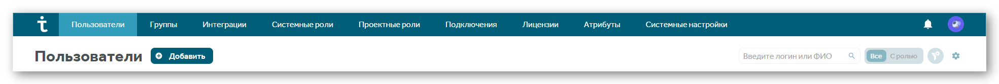

# Руководство администратора TeamStorm по добавлению пользователей

## Назначение документа 

Документ описывает действия администратора по добавлению пользователей и присвоению системных ролей.

## Вход в систему после установки 

### Вход

При установке в системе создается служебный пользователь с именем _admin_ и паролем _Qwerty123_. У данного пользователя есть права установки системы. При первом входе в систему:

1. Введите данные служебного пользователя (_admin_/_Qwerty123_).
2.  Нажмите **Войти** или `Enter`.

    <figure><figcaption></figcaption></figure>

### Смена пароля

После входа в систему рекомендуется сменить пароль. Для этого:

1. Нажмите на иконку профиля и выберите **Администрирование** в выпадающем меню. По умолчанию откроется раздел **Пользователи**.
2. Нажмите на пользователя **System Administrator**. Откроется окно редактирования пользователя.
3. Введите новый пароль в соответствующем поле.
4. Нажмите **Сохранить**.

## Вход в систему 

Для входа в систему:

1. Откройте страницу входа в TeamStorm.
2. В выпадающем списке  выберите, с помощью какого пользователя вы войдете в систему. По умолчанию указано значение Local — локальный пользователь TeamStorm . Дополнительно в списке могут отображаться подключения к LDAP-серверам, например к Active Directory, для авторизации с помощью пользователя AD.
3. Введите учетные данные администратора в поля **Имя пользователя** и **Пароль.**
4. **Опционально:** поставьте флажок **Запомнить меня**, чтобы не вводить учетные данные при следующем открытии браузера.
5. Нажмите **Войти** или клавишу  `Enter`**.**

<figure><figcaption></figcaption></figure>

## Настройка подключений через AD/LDAP 

После того, как системный администратор добавил необходимых пользователей в активную директорию (AD), вам необходимо настроить подключение по LDAP в системе TeamStorm.

1. Используя аккаунт с правами администратора, нажмите на иконку пользователя и перейдите в раздел **Администрирование**.
2. На верхней панели нажмите **Подключения**, убедитесь, что вы находитесь на вкладке **AD/LDAP**, нажмите **Создать**.
3. Заполните обязательные поля, нажмите **Протестировать**. В случае успешного тестирования сохраните подключение.

На вкладке **AD/LDAP** доступно редактирование соединения Active Directory (или LDAP) и кнопка для принудительной синхронизации. Чтение и синхронизация происходят каждые 10 минут.

В настройках AD/LDAP можно указывать схему пользователей и групп для поддержки большинства служб.

Реализована возможность добавлять пользователей только из одной группы в AD.

**User Schema:** Пример фильтра для пользователей из одной группы:

`(&(objectCategory=Person)(sAMAccountName=*)(memberOf=CN=Group-Sonya,OU=Sonya-test,OU=podrazdelenie2,OU=Podrazdelenie1,DC=mtest,DC=ru))`

Пример фильтра, который добавляет пользователей из вложенных групп:

`(&(objectCategory=Person)(sAMAccountName=*)(memberOf:1.2.840.113556.1.4.1941:=CN=Group-Sonya,OU=Sonya-test,OU=podrazdelenie2,OU=Podrazdelenie1,DC=meistertest,DC=ru))`

**Group Schema:** Фильтр для одной группы (имя начинается с ...) :

`(&(objectCategory=group)(name=Group-Sonya*))`

На странице подключений AD/LDAP можно создать несколько подключений, а также выбрать подключение по умолчанию.

<figure><figcaption></figcaption></figure>

Выбранное подключение по умолчанию будет отображаться на странице авторизации как основное.

## Добавление, редактирование и удаление пользователей 

Вы можете добавлять, удалять и редактировать данные пользователей, добавленных в систему локально, через Active Directory (AD) или через OpenID Connect. Чтобы открыть окно информации о пользователях:

1. Используя аккаунт администратора нажмите на иконку профиля. В открывшемся меню выберите **Администрирование**.
2. В открывшемся окне перейдите в раздел **Пользователи**.

### Добавление пользователей

Вы можете добавлять локальных пользователей в систему TeamStorm:

1. В разделе **Пользователи** нажмите **Добавить**.
2. В открывшемся окне укажите:
   * Логин пользователя - под этим логином пользователь сможет входить в систему.
   * Пароль пользователя.
   * E-mail пользователя.
   * ФИО - указанное имя будет отображаться в системе TeamStorm.
3. Нажмите **Добавить**.

После добавления новому пользователю присваивается системная роль.

Чтобы назначить системные роли пользователям:

1. Используя аккаунт администратора, нажмите на иконку профиля. В открывшемся меню выберите **Администрирование**.
2. В открывшемся окне перейдите в раздел **Системные роли**. В разделе отобразятся все пользователи и группы, добавленные в систему.
3. Если нужный пользователь не отображается, начните вводить его имя или логин в поле **Добавить пользователя**, далее выберите пользователя из результатов поиска.&#x20;
4. Поставьте флажок роли, которую вы хотите дать определенному пользователю или группе пользователей. Роль применится и сохранится автоматически. При добавлении пользователя через AD/LDAP к группе у которой есть права в системе, синхронизация может занять около 20 минут.

<figure><figcaption></figcaption></figure>

### Редактирование данных пользователя

После добавления пользователей вы можете просматривать всю информацию о них в разделе **Пользователи**. Используйте фильтр для кастомизации отображаемых данных. Настройки отображения сохраняются для текущего браузера.

Чтобы редактировать данные пользователя:

1. Нажмите на строку пользователя, данные которого хотите отредактировать.
2. Внесите изменения.
3. Нажмите **Сохранить**.

Вы можете менять данные только для локальных пользователей. Данные пользователей, добавленных через AD необходимо менять в AD.

### Удаление пользователей

Чтобы удалить локальных пользователей:

1. Поставьте флажок напротив локального пользователя (пользователей), которого хотите удалить из системы.
2. Нажмите **Удалить**.

<figure><figcaption></figcaption></figure>
